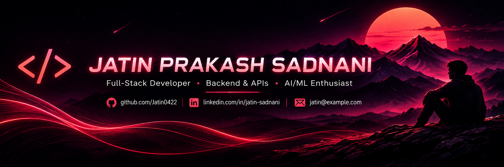
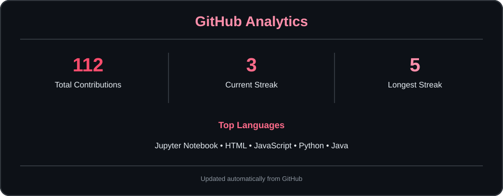

  

  

---

## 👨‍💻 About Me

I'm a full-stack developer  focused on building **practical, real-world applications** that combine full-stack development, backend engineering, data analysis, and machine learning.

I have a strong grip on the different components of full-stack development — from building responsive **frontend interfaces** and designing **databases** to developing **backend APIs, business logic, authentication, data processing, and application architecture**. While I enjoy working across the entire stack, I naturally lean more toward **backend development and the problem-solving side of applications**.

I'm also particularly interested in **Machine Learning and data-driven development**. I enjoy working with data, building predictive models, exploring forecasting and recommendation systems, and integrating intelligent features into practical applications rather than treating ML as something separate from software development.

What I enjoy most is taking a real problem, understanding its requirements and data, and turning it into a **complete, usable software solution** — from the frontend and backend to the database, business logic, and intelligent features.

### 🚀 Currently

- 🔭 Building **full-stack applications** with React, Django, Flask, Node.js and Express
- 🌱 Strengthening **backend engineering, REST APIs, system design, DSA and scalable application architecture**
- 🤖 Deepening my knowledge of **Machine Learning, model development, forecasting and recommendation systems**
- 🧠 Exploring **LLMs, Generative AI and AI-powered applications**
- 💻 Improving my ability to design and build **end-to-end real-world software solutions**
- 💼 Looking for **Software Development, Backend, Full-Stack and ML/AI internships**
- 🤝 Open to **interesting projects, collaborations and opportunities to build meaningful software**

---

## 🛠️ Tech Stack

### Languages

### Frontend

### Backend

### Databases

### Data & Machine Learning

`Pandas` · `NumPy` · `Matplotlib` · `Scikit-learn` · `XGBoost` · `CatBoost` · `Prophet`

### Tools

---

## 🚀 Featured Projects

<table>
<tr>

<td width="33%" valign="top">

### 🔷 Nexora

**Migration Intelligence Platform**

A full-stack platform designed to help users make data-driven decisions about **countries, careers and migration**.

**Highlights**

- 🌍 Migration trend analysis
- 📊 Country comparison
- 🏠 Cost-of-living analysis
- 💼 Jobs & salary information
- 💰 Salary prediction
- 📈 Migration forecasting
- 🎯 Country recommendations

**Stack**

`React` `Django` `DRF` `Python` `Machine Learning`

 

</td>

<td width="33%" valign="top">

### 📊 Retrix

**E-Commerce Return Analytics**

A data-driven application focused on analyzing **e-commerce return patterns and business performance**.

**Highlights**

- 📦 Return data analysis
- 📊 Business insights
- 🧹 Data preprocessing
- 📈 Return trend analysis
- 📉 Data visualization
- 🔎 Analytics workflow

**Stack**

`Python` `Flask` `Pandas` `NumPy`

 

</td>

<td width="33%" valign="top">

### 🏠 RentWise

**House Rent Analyzer**

A machine-learning application for **house rent analysis and prediction** using factors such as location, area, BHK, furnishing and income.

**Highlights**

- 🏠 House rent prediction
- 📊 Exploratory data analysis
- ⚙️ Feature engineering
- 🤖 ML model comparison
- 📐 Model evaluation
- 🌐 Flask application

**Stack**

`Python` `Flask` `Pandas` `Scikit-learn`

 

</td>

</tr>
</table>

<a href="https://github.com/Jatin0422?tab=repositories">
<strong>View All Repositories →</strong>
</a>

---

## 🧠 AI / ML

My machine-learning work includes **prediction, regression, forecasting, data preprocessing, feature engineering and model evaluation**.

| Area | Experience |
|---|---|
| **Regression** | Salary & house rent prediction |
| **Classification** | Prediction-based applications |
| **Forecasting** | Migration & wage forecasting |
| **Data Analysis** | Pandas, NumPy & visualization |
| **Feature Engineering** | Encoding, transformations & derived features |
| **Model Evaluation** | R², MAE, RMSE & cross-validation |
| **ML Libraries** | Scikit-learn, XGBoost, CatBoost & Prophet |

### Models I've Worked With

`Linear Regression` · `Random Forest` · `Decision Tree` · `Extra Trees` · `KNN` · `XGBoost` · `CatBoost` · `ARIMA` · `Prophet`

---

## 💼 Experience

### E-Commerce Business Owner

Managed an e-commerce business across **Amazon, Flipkart and Meesho**.

### Responsibilities

- 📦 Product listing and catalog management
- 🔎 SEO-focused product content
- 📢 Advertising and promotions
- 📊 Business performance monitoring
- 🔄 Order and return management
- 🛒 Marketplace operations
- 👥 Customer-related operations
- 📈 Using data to identify business trends and opportunities

This experience gave me practical exposure to **business operations, analytics, product management and solving real-world problems**.

---

## 📊 GitHub Analytics

---

## 📈 Contribution Activity

---

## 🌊 Contribution Flow

<picture>

<source
media="(prefers-color-scheme: dark)"
srcset="https://raw.githubusercontent.com/Jatin0422/Jatin0422/output/github-contribution-grid-snake-dark.svg?v=2">

<source
media="(prefers-color-scheme: light)"
srcset="https://raw.githubusercontent.com/Jatin0422/Jatin0422/output/github-contribution-grid-snake.svg?v=2">

</picture>

---

## 🎯 Current Focus

<table>
<tr>

<td width="33%" valign="top">

### 📚 Learning

- Deep-diving into applied ML — from scikit-learn model tuning to explainability tradeoffs in production
- System design fundamentals: scaling APIs, caching, and DB design for real-world traffic
- Django REST patterns for serving ML models behind clean, versioned APIs
- Exploring how LLMs fit into traditional data pipelines (RAG, agentic workflows)

</td>

<td width="33%" valign="top">

### 🔨 Building

- Data-driven dashboards that turn raw datasets into decision-ready insights
- ML-backed prediction tools wrapped in clean, usable interfaces
- Analytics systems for real-world domains I understand firsthand (e-commerce, migration)
- Tools and resources that help other students skip the "where do I even start" phase

</td>

<td width="33%" valign="top">

### 🔭 Exploring

- Explainability techniques for recommendation and scoring systems — feature importance, confidence intervals, and interpretable outputs
- API design patterns for serving ML models efficiently — caching layers, async inference, and request batching
- Deployment strategies across platforms like Render and Vercel — cost tradeoffs, cold starts, and scaling limits
- Core system design concepts — load balancing, failure handling, and scalability patterns beyond textbook theory

</td>

</tr>
</table>

---

## 🤝 Connect With Me

 

### Building. Learning. Improving. 🚀

<i>Turning ideas into real-world software.</i>

